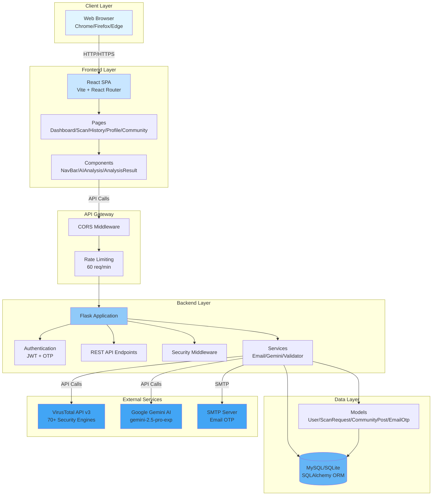
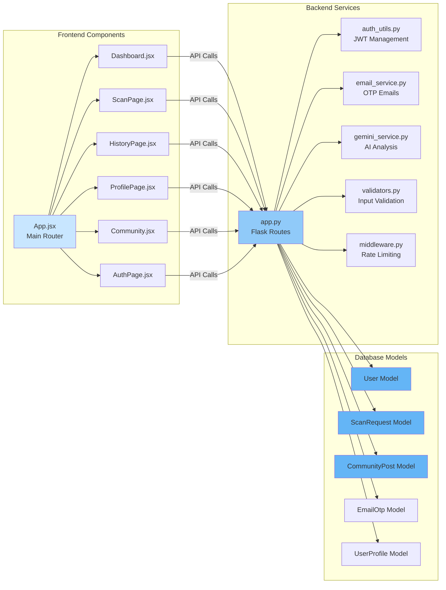
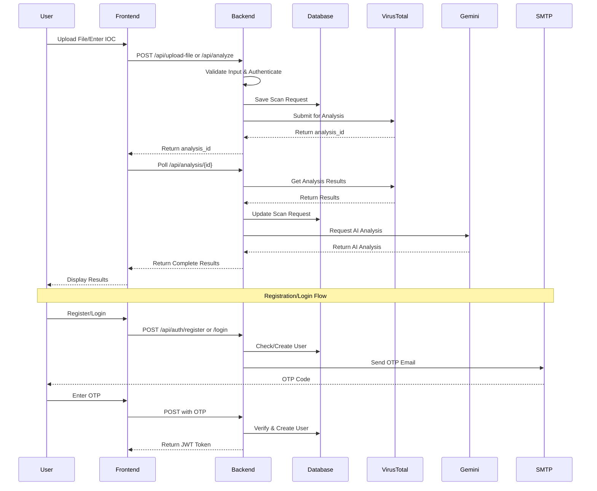
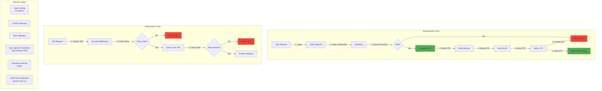
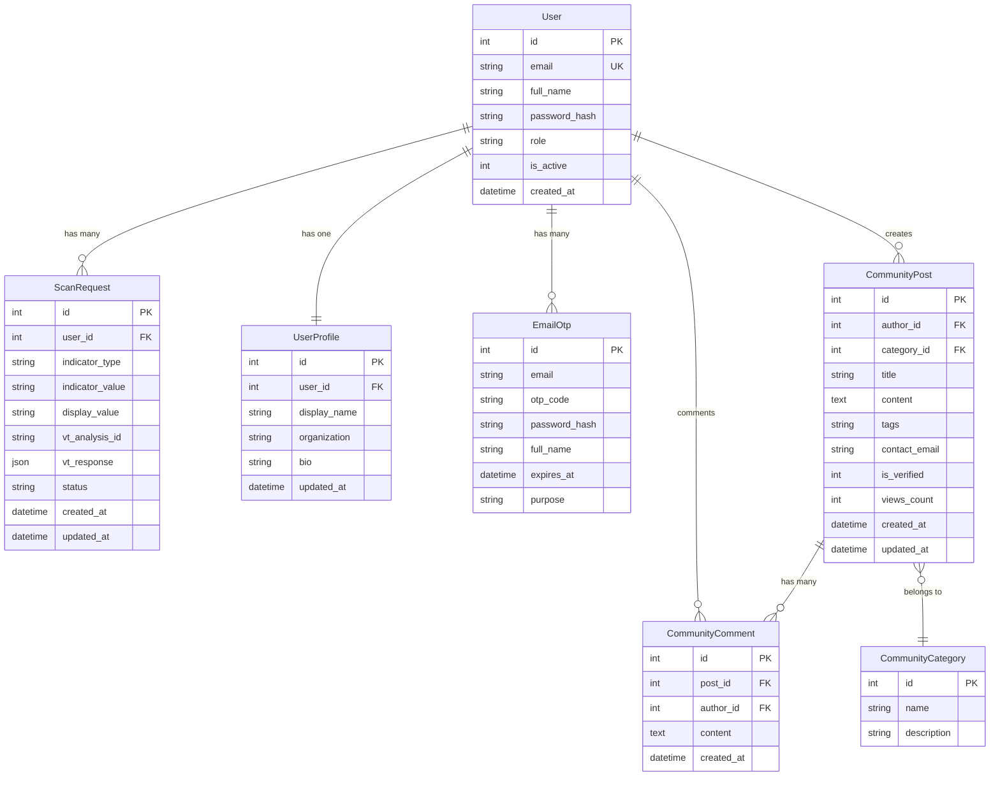
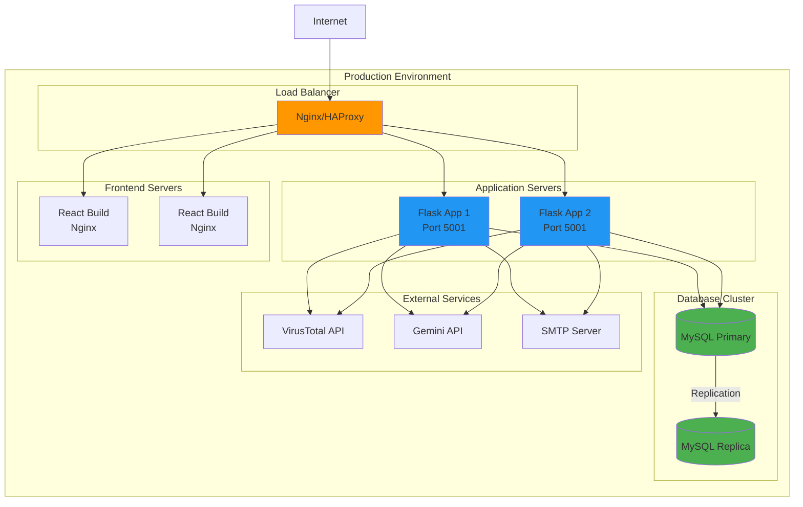
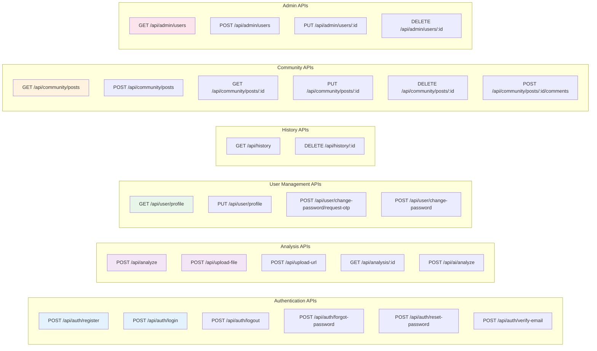
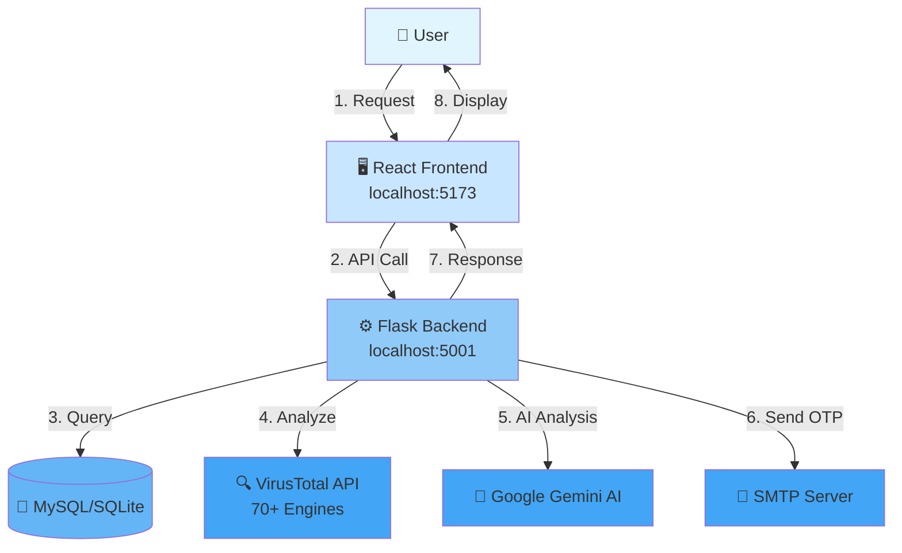
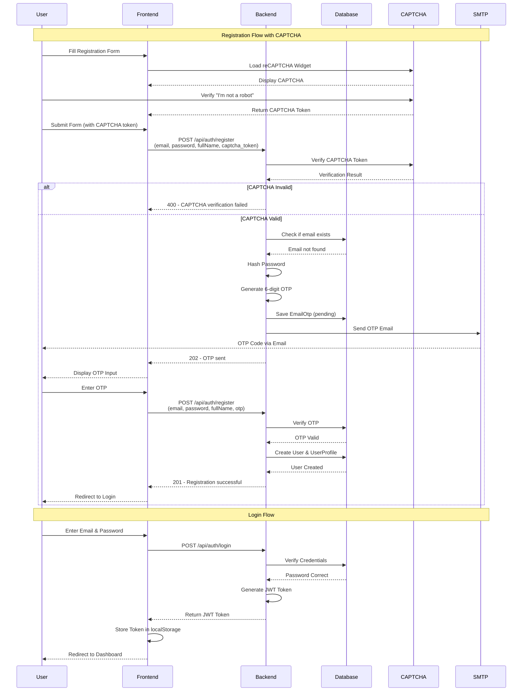
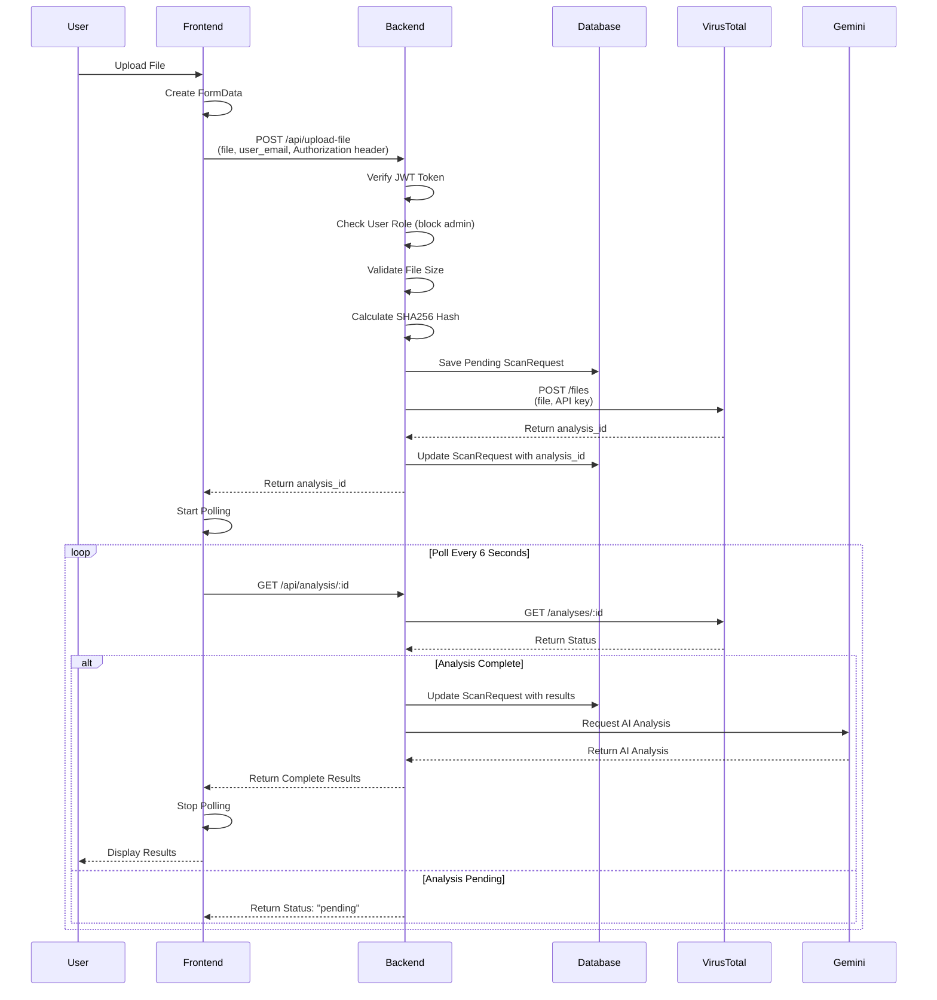

# SYSTEM ARCHITECTURE DIAGRAMS
## Ransomware Analysis Portal

Tài liệu này chứa các sơ đồ kiến trúc hệ thống được tạo bằng Mermaid. Bạn có thể xem các diagram này trong:
- GitHub (tự động render)
- VS Code với extension Mermaid Preview
- Mermaid Live Editor: https://mermaid.live
- Các công cụ hỗ trợ Mermaid khác

---

## 1. OVERALL SYSTEM ARCHITECTURE

Sơ đồ tổng quan về kiến trúc hệ thống với 6 lớp chính.

---

## 2. DETAILED COMPONENT ARCHITECTURE

Sơ đồ chi tiết về các component và tương tác giữa chúng.

---

## 3. DATA FLOW DIAGRAM

Sơ đồ luồng dữ liệu từ người dùng đến các dịch vụ bên ngoài.

---

## 4. SECURITY ARCHITECTURE

Sơ đồ về các lớp bảo mật và xác thực.

---

## 5. DATABASE SCHEMA RELATIONSHIP

Sơ đồ quan hệ giữa các bảng trong database.

---

## 6. DEPLOYMENT ARCHITECTURE

Sơ đồ triển khai hệ thống.

---

## 7. API ENDPOINTS ARCHITECTURE

Sơ đồ các API endpoints và nhóm chức năng.

---

## 8. SIMPLIFIED SYSTEM OVERVIEW

Sơ đồ đơn giản hóa về hệ thống.

---

## 9. USER REGISTRATION & AUTHENTICATION FLOW

Sơ đồ chi tiết về luồng đăng ký và xác thực người dùng.

---

## 10. FILE UPLOAD & ANALYSIS FLOW

Sơ đồ chi tiết về luồng upload file và phân tích.

---

## CÁCH SỬ DỤNG

### 1. Xem trong GitHub
- File này sẽ tự động render các diagram Mermaid trong GitHub
- Chỉ cần commit và push lên repository

### 2. Xem trong VS Code
- Cài đặt extension: "Markdown Preview Mermaid Support"
- Mở file và nhấn `Ctrl+Shift+V` (Windows) hoặc `Cmd+Shift+V` (Mac)

### 3. Xem trong Mermaid Live Editor
- Copy code Mermaid từ file này
- Paste vào: https://mermaid.live
- Diagram sẽ được render ngay lập tức

### 4. Export sang hình ảnh
- Sử dụng Mermaid CLI: `mmdc -i input.mmd -o output.png`
- Hoặc dùng Mermaid Live Editor để export PNG/SVG

---

## GHI CHÚ

- Tất cả các diagram được tạo bằng Mermaid syntax
- Có thể chỉnh sửa và tùy chỉnh theo nhu cầu
- Đảm bảo cài đặt extension hoặc công cụ hỗ trợ Mermaid để xem
- Các diagram này phản ánh kiến trúc hệ thống tại thời điểm phân tích

---

**Cập nhật lần cuối**: 2025-12-03  
**Phiên bản**: 1.0.0  
**Dự án**: Ransomware Analysis Portal

